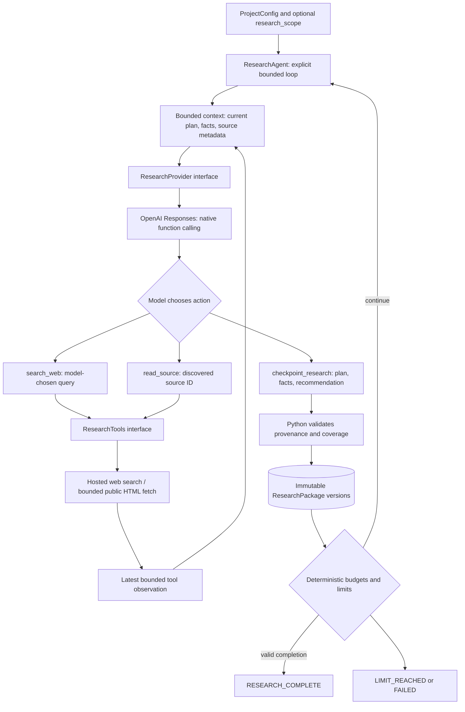
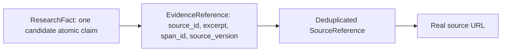

# Agentic History Studio

Agentic History Studio is an AI engineering project for source-grounded historical documentaries with explicit human review. The planned first documentary is a five-minute Chinese film about Li Bai (李白).

**Under active development. Phase 1 infrastructure and Phase 2 autonomous research are implemented.** Research uses the official OpenAI Python SDK and Responses API. Fact checking, RAG, storytelling, and media production are future phases. The normal test suite is offline and free; the `research` command makes paid API calls.

## Research Agent responsibility

The Research Agent collects **candidate evidence**, not verified historical truth. It creates and evolves its own research questions, chooses search queries and source reads, identifies gaps, and recommends when coverage is sufficient. Its plan needs no human approval. A generic optional `research_scope` constrains the investigation; outside-scope reading is permitted only for minimal context needed by an in-scope claim.

The agent does not write narration or dialogue, create a story, score source reliability, adjudicate disputed claims, or approve its own work. Research confidence is explicitly distinct from verified confidence. Competing claims coexist under a shared `dispute_group_id`.

## Architecture



`ResearchAgent` depends on two protocols, not OpenAI objects. `ResearchProvider` returns typed native function calls and usage. `ResearchTools` exposes search and source reads. `openai_provider.py` isolates SDK requests, strict schemas, provider pricing, and hosted search. There is no agent framework or natural-language action parser.

Each iteration has up to eight model turns. The model can search/read several times before calling `checkpoint_research`. That tool supplies the entire evolving plan and new/updated facts. Existing gap IDs, questions and critical flags cannot silently disappear or change; the model may add new questions and update statuses. Covered gaps require fact references. A completed or interrupted iteration publishes a self-contained checkpoint. An initial empty checkpoint and explicit terminal-condition checkpoints are also retained.

Progress is measured from accepted state, not artifact versions. Newly accepted claims (including competing claims), canonical evidence, discovered source URLs, read representation versions, new research questions, and forward goal-status transitions count. Carry-forward evidence, repeat reads of the same representation, confidence/notes/title edits, and status regression/re-promotion do not. Hashed historical signals prevent repeated credit across iterations and resumes.

A valid but non-progressing checkpoint returns structured `no_progress` feedback with unresolved goal IDs and exact completion deficits, including distinct **cited** sources. It is not published and does not end the iteration; the Agent retains current read spans and chooses its next action freely. `max_no_progress_checkpoints` defaults to 3 consecutive attempts, then stops with `no_progress_limit`. The streak and previous checkpoint outcome persist in the runtime ledger; resume does not clear the guard. Genuine progress resets the streak. Deterministically valid `COMPLETE` is accepted even if no additional evidence was needed. Existing turn, iteration, context, and spending limits still apply.

## Provenance and contracts



- `HistoricalTime` retains the original `display` alongside optional `start_year`, `end_year`, and precision. Years use astronomical numbering (0 = 1 BCE). Era names and uncertain dates need not be converted to exact Gregorian dates.
- `ResearchFact` has a stable `fact_id`, one `claim`, structured historical time, `research_confidence`, evidence, optional dispute group, and `research_notes`. Structural validation rejects claim lists and semicolon-separated bundles; semantic atomicity and scope adherence still require model judgment and later review.
- `read_source` exposes a bounded list of `{span_id, text}` entries, `source_id`, `source_version`, and `truncated`. The Agent selects `{source_id, span_id}` in checkpoint evidence; it never supplies excerpt text or character offsets. Python resolves the selection and persists the canonical excerpt. Unread sources, invented spans, source mismatches, and stale versions are rejected with structured diagnostics. Search summaries are **never** evidence. The existing whitespace-normalized exact-substring check remains a final invariant.
- Span generation normalizes whitespace over the exact retained read text, then packs Chinese/English sentence endings into spans of at most 600 Unicode code points. Without a usable sentence boundary, it prefers whitespace in the latter half of that window, then falls back to a hard bounded split. HTML entities and markup are handled by the existing source reader. Paragraph breaks have already been normalized away. Source version is SHA-256 of the algorithm version, source ID, retained normalized text and truncation flag; span ID hashes that version plus Python-owned start/end boundaries. No offsets need to be calculated by the Agent.
- Span text and metadata count toward the existing observation allocation. If needed, Python drops trailing spans, marks truncation, and recomputes identity for the exact exposed representation. Current-iteration reads are transient; correction context retains only the latest read's spans. A reread replaces that source's current representation. Unchanged facts may be omitted or resubmitted. For the same fact, accepted source/span IDs carry the complete persisted evidence record forward without a reread, including across resume. New or changed selections still require a current-iteration read; proposals cannot override excerpt or source-version fields.
- Existing `ResearchPackage` version 2 artifacts remain readable with absent `span_id`/`source_version`; no files are migrated or rewritten. New evidence stores both fields alongside canonical excerpt text. Old native checkpoint proposals containing `excerpt` are rejected: the proposal contract is now selection-only. The evidence chain remains fact → evidence → source.
- Source IDs are deterministic hashes of canonical URLs. Fragments and common tracking parameters are removed, query parameters sorted, and repeated URLs deduplicated. Source types default to `UNKNOWN` until classification is available; no numeric quality score is assigned. Publisher/domain and metadata are separate from fact evidence.
- One `ResearchPackage` versions the plan, facts, source table, run ID, iteration, status and stop condition together. Source metadata is not duplicated in Phase 2 facts.
- Phase 1 `ResearchFact` field names and embedded-source objects remain readable. New packages reject legacy embedded provenance and require structured time and evidence. Legacy JSON is not silently migrated into source-grounded research.
- Research notes remain explicitly separate metadata. `facts_without_research_notes()` provides an intentional projection for later consumers; no Story Agent is implemented and candidate facts are not automatically approved for storytelling.

A source-derived excerpt proves provenance, not that the source is reliable or the claim follows from it. Those are deliberately left for independent fact checking.

## Context management

Every model turn starts from current structured state, not accumulated conversation history. Context includes project/scope, instructions, all compact facts, current plan, source metadata, remaining limits, and the latest tool call/result. The adapter sends native `function_call` / `function_call_output` items; it does not use `previous_response_id` or retain hidden reasoning.

Defaults reserve 24,000 characters for dynamic context, including at most 9,000 characters for the latest observation/call. Source passages are capped at 8,000 characters and fetched bodies at 1 MB. The fixed tool schemas are counted separately in cost reservations. If structured state or the latest observation cannot fit, the run explicitly stops with `LIMIT_REACHED`; facts or critical gaps are never silently truncated out of the plan. Raw page text and the span registry are transient and discarded after the iteration; bounded latest-read spans survive validation feedback within that iteration. Stored evidence excerpts remain in subsequent compact context.

## Limits and cost accounting

| Setting | Normal default | Smoke configuration |
|---|---:|---:|
| Soft research budget | $0.50 | $0.20 |
| Hard research budget | $1.00 | $0.35 |
| Iterations | 12 | 5 |
| Searches | 20 | 8 |
| Source reads | 30 | 12 |
| Minimum facts | 3 | 2 |
| Minimum cited sources | 2 | 2 |

The project budget also caps the research budget. Limits count attempted calls, including failures, across resumes. The model receives a soft-budget signal to consolidate. Completion requires the model's `COMPLETE` recommendation, a nonempty plan and coverage summary, enough facts and **cited** sources, and no unresolved critical gaps. Hitting a hard limit produces `LIMIT_REACHED`, never `RESEARCH_COMPLETE`.

Before every paid request, the runtime durably reserves a conservative upper estimate using UTF-8 request bytes, tool schemas, a framing allowance, maximum output tokens, and configured provider rates. Search adds a bounded hosted tool fee and conservative search-content allowance. Reservations are never refunded, even after timeouts, missing usage, or process interruption. This deliberately may stop earlier than actual billing would require. SDK automatic retries are disabled. Hosted search is restricted to one built-in call per search request.

`.runtime/research_usage.json` records models, token counts where available, model/tool/search/read counts, estimated model/tool cost, committed reservation, and unknown/pending usage. Missing usage remains explicitly unknown. An observed estimate above the reservation stops the run and blocks further requests rather than silently accepting a pricing mismatch. These are configured estimates and admission limits, **not a provider-side invoice guarantee**; pricing/account changes or incorrect custom rates require review.

The provider defaults to `gpt-4.1-mini` with configurable decision-model rates. Changing the decision model requires a matching explicit `pricing_model` and rates in run configuration. The initial search adapter uses `gpt-4.1-mini` because its non-preview search-content billing has a documented fixed block. Its tool fee and rates are centralized and configurable. Search usage estimates conservatively add that block even when response usage may already include it. Request reservations count the fixed search-content block once, plus the request byte bound, framing allowance, maximum output tokens, and one tool-call fee. Cached discounts are not assumed.

Official references: [native function calling](https://developers.openai.com/api/docs/guides/function-calling), [web search and source metadata](https://developers.openai.com/api/docs/guides/tools-web-search), [GPT-4.1 mini pricing](https://developers.openai.com/api/docs/models/gpt-4.1-mini), and [tool pricing](https://developers.openai.com/api/docs/pricing). Defaults were checked on 2026-09-26; verify account pricing before paid runs.

## Persistence, failure and resume

```text
projects/<project-id>/
  project.json
  research/
    research_v1.json
    research_v2.json
    ...
  .runtime/                    # Git ignored
    state.json
    research_usage.json
    diagnostics/               # immutable, sanitized checkpoint validation records
      diagnostics_v1.json
    research_settings.json
    research_config.json
    research.lock              # only while a run is active
```

The existing ArtifactStore publishes UTF-8 JSON atomically with exclusive hard links; old versions are never overwritten. Runtime snapshots use atomic replacement. Local hard-link support (for example, NTFS) is required. Process termination can leave an ignored `.pending-*.tmp` file; power-loss durability is outside the guarantee.

Successful research persists and validates its complete package **before** moving `CREATED → RESEARCHING → RESEARCH_COMPLETE`. A crash between package publication and workflow advancement is reconciled on the next invocation without another model call. Failure retains completed work, records a safe operational error code, and preserves `last_successful_state=CREATED` with `failed_state=RESEARCHING`. Intermediate research packages are durable data checkpoints, not new workflow states. Recovery retries research using the latest valid package; it does not discard earlier facts.

A corrupt latest package is skipped with an operational event, and an earlier valid checkpoint is loaded; all old files remain intact. If none is valid, the run refuses to start over. A missing, mismatched or invalid usage ledger blocks paid continuation, since discarding it could reset spending limits. An interrupted iteration still counts as attempted; transient page observations may need to be read again.

Rejected `checkpoint_research` proposals now produce versioned diagnostics in `.runtime/diagnostics/diagnostics_vN.json`. Each records the run ID, iteration/turn, operation, exception class, validation error type, schema field/location, and a concise safe message. The CLI prints these details immediately; `status` displays the latest recorded diagnostic, including after a later successful correction. Each record includes at most 12 errors and the total count. Raw arguments, invalid input values, Pydantic error context, unknown field names, arbitrary exception text and private reasoning are excluded. Built-in errors use safe messages; known static domain validator messages are preserved.

Pydantic contract failures and explicit provenance/identity rejections during proposal validation are returned as a native tool-result `validation_error` observation. The model may correct its proposal on the next existing turn. Rejected proposals do not change the accepted plan/facts, and the current iteration's retrieved passages remain available to deterministic evidence checks. No retry counter or budget is reset: turn, iteration, context and paid-call admission limits remain authoritative; exhausted correction attempts produce `LIMIT_REACHED`. Unexpected provider, storage and internal failures still fail the stage. Storage/workflow operations have separate failure labels rather than being mislabeled as artifact validation. Diagnostics cannot reconstruct the missing details of runs made before this change.

Only one local runner may hold `research.lock`. After a killed process, confirm there is no active runner before manually removing a stale lock. Do not delete the usage ledger to bypass limits. Re-running `research` uses saved configuration unless an explicit `--config` override is supplied. To continue a limit-reached run, deliberately raise the relevant **cumulative** limit in that configuration. Ordinary `resume` remains read-only and reports the retry stage and durable checkpoint.

The Phase 1 state machine and human approval gates remain intact. Running stages do not advance `last_successful_state`; `failed_state` records the interrupted stage. Later approval identity remains `(project_id, stage, artifact_version)`. No Phase 2 code performs final fact approval.

## Setup and CLI

Use Python 3.13:

```bash
python -m venv .venv
# Linux/macOS:
source .venv/bin/activate
# Windows PowerShell instead:
# .venv\Scripts\Activate.ps1
python -m pip install -e ".[dev]"
python -m pytest -q
```

Runtime dependencies are **Pydantic** for validated contracts and **OpenAI** for the official Responses API. **pytest** is development-only; **setuptools** builds the package. HTML parsing, bounded HTTP source reads, context construction, orchestration and persistence use the standard library. No agent framework is installed.

```bash
python -m history_studio create --project-id example --topic "Historical subject" --research-scope "Requested period or aspect" --language zh-CN --duration 5 --budget 20
python -m history_studio status example
python -m history_studio review example facts
python -m history_studio resume example
# Paid, environment credentials required:
python -m history_studio research example
python -m history_studio research example --config examples/research-smoke.json
```

Use `--projects-dir /path/to/projects` **before** the command to choose a different root. Research exit codes are `0` complete, `2` limit reached, `1` failed/configuration error. Operational output shows iterations, chosen search queries, tool calls, checkpoint versions, counts, and cost summary; hidden model reasoning and provider exception bodies are never printed or persisted.

Set `OPENAI_API_KEY` in the process environment. `.env.example` documents the name; the CLI does **not** automatically load `.env` files. Credentials are not accepted in project/run JSON. The SDK connects to the official endpoint with automatic retries disabled.

## Manual paid Li Bai early-life smoke test

This path is opt-in and is **not** executed by pytest or during implementation. With the virtual environment activated, set `OPENAI_API_KEY` using your normal secret-management process. For PowerShell, an interactive entry avoids putting a literal key into shell history:

```powershell
$env:OPENAI_API_KEY = [System.Net.NetworkCredential]::new('', (Read-Host 'OpenAI API key' -AsSecureString)).Password
python -m history_studio create --project-id li_bai_early_life --topic "李白" --research-scope "李白出生至20岁以前的生平" --language zh-CN --duration 5 --budget 20
python -m history_studio research li_bai_early_life --config examples/research-smoke.json
python -m history_studio status li_bai_early_life
```

The smoke config changes only guardrails and minimum coverage, not agent logic or research questions. The agent chooses its own plan and searches. A tiny budget may legitimately yield `LIMIT_REACHED`, and source access/API availability may yield `FAILED`; neither is represented as success. Resume with the same command after resolving an error. A completed rerun makes no model calls.

Inspect the latest `projects/li_bai_early_life/research/research_vN.json` and earlier versions. Trace each `facts[].evidence[].source_id` to `sources[].source_id`, open the source URL, and compare the exact excerpt. Review whether claims stay before age 20, questions evolved autonomously, uncertain dates retain uncertainty, competing claims share dispute IDs where appropriate, and the final plan supports coverage. Check `.runtime/research_usage.json` against the configured limits and `.runtime/state.json` for `RESEARCH_COMPLETE`. Do not mistake a research-complete package for verified facts.

## Repository structure

```text
examples/research-smoke.json
src/history_studio/
  __init__.py, __main__.py, cli.py
  models/
    base.py, project.py, sources.py, research.py
    historical_time.py, research_package.py
    facts.py, story.py, script.py, storyboard.py, __init__.py
  research/
    actions.py, agent.py, boundaries.py, config.py, context.py
    openai_provider.py, usage.py, web_tools.py, diagnostics.py, __init__.py
  workflow/
    states.py, state_machine.py, approvals.py, __init__.py
  storage/
    artifact_store.py, __init__.py
tests/
  conftest.py
  test_models.py, test_state_machine.py, test_artifact_store.py, test_cli.py
  test_research_models.py, test_research_agent.py, test_research_usage.py
  test_openai_provider.py, test_research_web_tools.py, test_research_cli.py
  test_research_validation.py
projects/.gitkeep
```

Projects and public demo artifacts remain eligible for Git; review generated research before committing. `.env`, `.venv/`, `.runtime/`, `.logs/`, `.cost/`, and `.generated/` are ignored. No logs, costs, generated media, credentials, or local runtime state should be committed.

## Testing and limitations

`python -m pytest -q` is deterministic, offline and free. An autouse socket guard blocks network access. Provider/tool fakes test orchestration; an HTTP mock transport exercises actual SDK request/response conversion, strict schemas and native tool-output handling. No real integration test runs automatically.

The initial reader handles bounded public HTML/text, not PDFs, authenticated pages, JavaScript rendering, paywalls, or crawling. It validates public IP addresses, pins the connection to the checked address, verifies TLS hostnames, rechecks redirects, and does not send cookies/proxies. It currently reads the beginning of each document, so relevant evidence further down a long page may be unavailable. URL deduplication does not infer that different URLs or mirrored documents are semantically the same source.

Scope adherence, atomic meaning, relevance, completeness of the model-created gap list and quotation entailment cannot be proven by Pydantic. Structural and exact-excerpt checks are guardrails, not a hidden Fact Checker. Source text remains untrusted; prompt-injection resistance is bounded by the model's behavior and the narrow tool permissions. The default adapter is tested with a non-reasoning text model; other decision models must support the supplied Responses function schemas and stateless tool-output input. No paid compatibility claim is made for arbitrary models.

There is no distributed lock, exactly-once provider execution, or cross-file transaction. Reservations and checkpoints make local recovery conservative; a lost response may have incurred a charge and a retried read/model request may consume more of the original budget. The real smoke test must still establish live provider and source behavior.

## Roadmap and phase boundary

- **Phase 1:** typed contracts, explicit workflow, external human approval records, immutable artifacts, runtime snapshots and CLI.
- **Phase 2 (current):** autonomous research planning, native tool calling, source-derived evidence, bounded context, budgets, checkpoints and resume.
- **Later:** independent Fact Checker, human fact approval application, verified knowledge base, embeddings/vector storage/RAG, Story Architect, Script Writer, grounding validation, Visual Director, image/video/TTS generation, FFmpeg assembly and publishing.

No Phase 3+ behavior is implemented.
