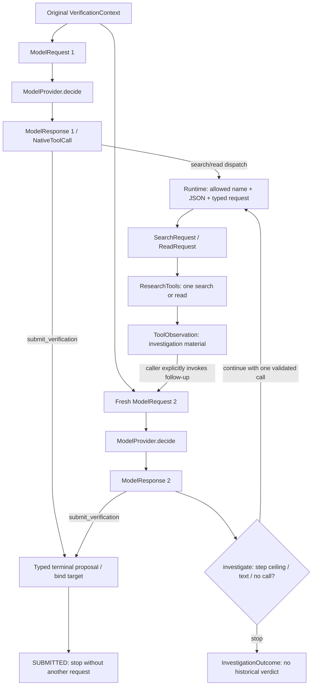
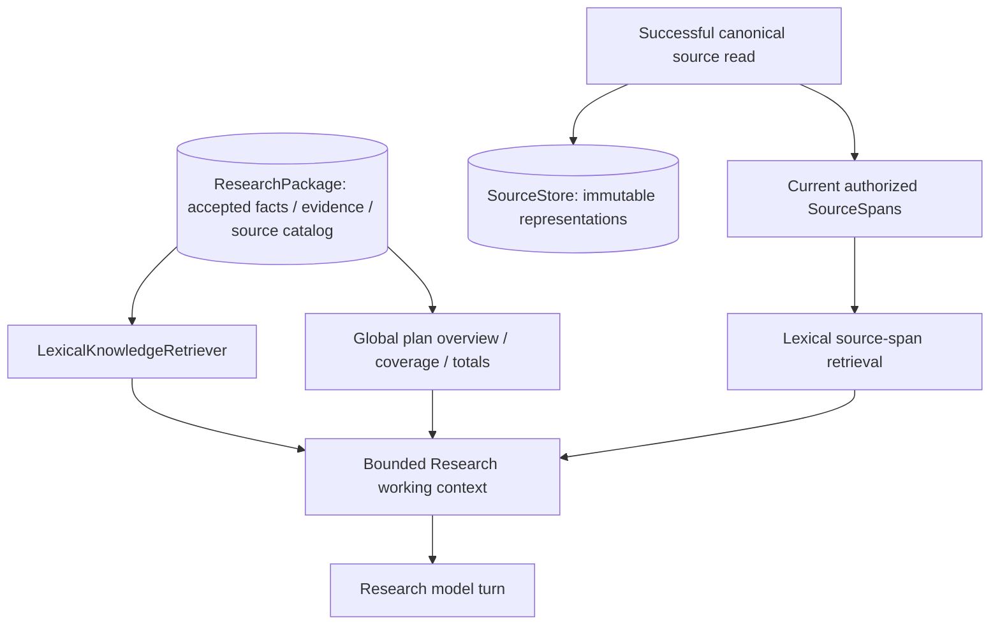

# Agentic History Studio

Agentic History Studio builds source-grounded historical documentaries with explicit human review. The first planned documentary is a five-minute Chinese film about Li Bai (李白).

**Implemented:** project/state/artifact infrastructure, autonomous research with bounded retrieval, verification contracts, and FactChecker decisions, search/read dispatch, observation round trips, bounded autonomous investigation, and terminal semantic submission. Explicit canonical evidence acceptance and VerificationResult construction are implemented; persistence and workflow integration remain planned. The normal test suite is offline; the CLI `research` command makes paid requests.

## System and responsibility boundaries

**Agent owns semantic decisions. Runtime owns deterministic invariants.** The Agent chooses what to investigate, which search/read action is useful, and how source material supports, contradicts, or qualifies a claim. Python enforces allowed capabilities, JSON parsing, typed inputs, tool execution, context bounds, provenance, persistence, and workflow state. A canonical quote proves where text came from; it does not prove reliability or entailment.

```mermaid
flowchart LR
    Scope[Project scope] --> Research[ResearchAgent: implemented]
    Research --> Package[(ResearchPackage)]
    Package --> Context[One-claim VerificationContext]
    Context --> Checker[FactChecker: bounded investigation]
    Checker --> Submission[VerificationSubmission: semantic proposal]
    Submission --> Acceptance[Explicit Runtime provenance acceptance]
    Acceptance --> Result[VerificationResult]
    Result -. planned integration .-> Human[Human fact approval]
    Human -. planned .-> Downstream[Story / script / media pipeline]
```



| Component | Investigation boundary | Current output |
|---|---|---|
| ResearchAgent | Discovery-driven: scope → goals → search/read → candidate facts | Immutable ResearchPackage checkpoints |
| FactChecker | Claim-driven: one ResearchFact → claim-specific investigation | InvestigationOutcome with optional terminal VerificationSubmission; explicit finalization produces VerificationResult |

Independent verification retains original research provenance as inspectable input. It does not restart broad topic research or treat research confidence as verified confidence. Research may preserve competing claims under a shared `dispute_group_id`; it does not adjudicate them, approve facts, or create narration/media.

## Model and tool execution

`ModelRequest` is Python's input to the generic model boundary: instructions, string/message input, tool definitions, tool choice, and output-token limit. `ModelProvider.decide(request)` returns `ModelResponse`: native calls, text, usage, status, and optional incomplete reason. A `NativeToolCall` carries `call_id`, `name`, and raw JSON `arguments`. It requests an action; it does not execute it.



Tool definitions describe capabilities. Model-requested calls and Python execution are separate steps; tool arguments are untrusted model output. `SearchRequest` validates a query and `ReadRequest` validates a source ID before the shared tool methods run:

```python
tools.search_web(request.query)
tools.read_source(source_reference, max_chars)
```

`ToolObservation` contains `kind` (`search` or `source`), source metadata, text, optional source ID, truncation flag, and usage. Search results are leads; read text is investigation material. Neither automatically becomes accepted evidence. The OpenAI search adapter returns at most eight source records and no synthesized evidence text; the reader returns bounded public HTML/text.

### Provider dependency structure

```text
FactChecker → ModelProvider → OpenAIModelProvider
ResearchAgent → ResearchProvider → OpenAIResearchProvider
                                      → ModelProvider → OpenAIModelProvider
```

These are injected protocols with OpenAI implementations. `OpenAIModelProvider` sends one Responses request with `parallel_tool_calls=False` and `store=False`, then maps output into generic contracts. It does not decode action arguments or interpret historical meaning. Generic transport is separate from Agent-specific policy.

`OpenAIResearchProvider` constructs research tool schemas, requires a completed response with exactly one function call, decodes its JSON into a typed research `ToolCall`/`ModelReply`, and supports cost reservations. ResearchAgent then validates the allowed action and its domain input. Its native tools are `search_web`, `read_source`, and `checkpoint_research`, with `tool_choice="required"`.

FactChecker uses the generic boundary directly and supplies verification instructions. Its current investigation turns use `tool_choice="required"` when tools are configured and `"none"` otherwise. With tools configured, the action set is search_web, read_source, and submit_verification: the model can investigate or submit. Submission alone does not produce a canonical VerificationResult; explicit finalization does. No-tools behavior remains tool_choice=none.

## FactChecker: one claim, bounded investigation

One atomic `ResearchFact` projects to one `VerificationContext` and eventually one `VerificationResult`. `build_verification_context(package, research_fact_id, research_input_ref=...)` selects a detached target fact plus exactly the source records referenced by its evidence. The contract enforces `TARGET_CLAIM_ONLY` and forbids whole-topic research.

The single-turn APIs remain independently callable; the investigation API composes them:

- `prepare()`: serialize instructions and the original one-claim context; no model request.
- `decide_next_action(max_output_tokens=3000)`: one model request; return its response unchanged.
- `execute_tool_call(call, max_chars=8000)`: validate and execute exactly one search/read call; return the same tool observation. Malformed/non-object JSON, invalid typed arguments, unknown names, and `checkpoint_research` fail before execution.
- `decide_after_observation(observation, max_output_tokens=3000)`: one follow-up request containing original context plus one current observation; return the response without executing another action or interpreting a verdict.
- `submit_verification(call)`: validate the terminal action separately from external dispatch and bind it to the original target, returning an unaccepted semantic proposal.
- `finalize_submission(submission)`: authenticate every selected read span, extract canonical VerificationEvidence, and construct VerificationResult without model, tool, or storage calls.

Reads resolve metadata from original context sources or prior explicit search dispatches. This in-memory source lookup supports execution; it is not evidence authorization or Agent knowledge. Dispatch preserves the original context and does not invoke the provider.

The follow-up input is fresh JSON with `verification_context`, `observation_role`, and `current_observation`. It includes search metadata/snippets or canonical read spans and metadata, preserves truncation, and excludes observation usage from model input. After an authorized read, canonical spans replace duplicate raw text only in model input; ToolObservation itself remains unchanged. The complete serialized observation must fit **12,000 characters**, including JSON escaping and metadata; otherwise it fails before a model call. This is an observation bound, not a total-request/token bound. The original context is claim-bounded but has no separate aggregate character cap.

`investigate(max_steps=4, max_output_tokens=3000)` composes **Reason → Act → Observe → Reason** into a bounded autonomous investigation. Each step makes one provider decision and handles exactly one requested action: execute at most one search/read, or validate a terminal submit_verification. Runtime owns the positive-integer step ceiling; the Agent chooses actions. A valid executable decision has exactly one call. Multiple calls, unsupported names, malformed arguments, and non-completed response statuses fail as protocol errors; provider/tool exceptions propagate without retries.

The transient `InvestigationOutcome` contains `final_response`, accumulated `observations`, `steps`, `stop_reason`, and optional `submission`. A valid submit_verification returns SUBMITTED immediately, even on the last allowed step, without an external tool execution or another provider request. At the ceiling, the last valid requested action executes and the loop returns LIMIT_REACHED without an extra model call. With no tool call, nonblank text produces MODEL_TEXT and an empty/whitespace response produces NO_TOOL_CALL. None is a historical verdict or UNVERIFIED.

Only the current observation enters the next fresh request. Runtime observation history is returned for reporting, not replayed as a model transcript. Source lookup metadata survives steps to support discovered-source reads. Each investigation invocation starts with the original claim context and a fresh step/history count; there is no persistence or cumulative FactChecker budget accounting yet. Single-turn methods still return their output without automatic dispatch. Native tool calling also serves as a structured decision protocol: search/read request external execution, while submission requests terminal contract validation. Terminal submission is an Agent action, not an external tool: NativeToolCall → JSON/typed validation → Runtime target binding → VerificationSubmission → STOP. The Agent supplies status, proposed supporting/contradicting selections, unresolved issues, independence note, and rationale. Each selection has source_id and span_id; free-text locators, excerpts, and replacement versions are rejected. A submitted selection is not yet accepted evidence or proof of independence. Runtime supplies research_fact_id and the exact claim_snapshot, rejects identity overrides and unknown sources, and reuses VerificationResult's status-structure rules for proposals. Submission has no verification_id; finalization derives a V-prefixed SHA-256 identity from the complete canonical result payload using the verification-v1 convention. Malformed submission is a protocol error, never UNVERIFIED. Finalization is a separate explicit call after SUBMITTED. Known source metadata is not read authorization. Only successful FactChecker reads populate detached canonical SourceSpans and pinned source-URL authorization state. Original research evidence and search snippets never seed this registry. New investigate() invocations clear it; direct dispatch/finalization share the current in-memory operation. Rereading changed content replaces that source's current representation, making earlier span selections stale. Canonical state persists across steps separately from model context, without SourceStore persistence.

Runtime reuses make_spans and resolve_selection to validate source ownership/version and extract exact normalized source text, then constructs VerificationEvidence separately for supporting and contradicting roles. It does not infer historical meaning or independence. Duplicate entries and order remain as submitted, matching the existing evidence-list contracts. Provenance failure rejects finalization without changing the Agent's status. Independently rereading an original source permits canonical provenance acceptance, but does not establish informational independence.

## Evidence and identity contracts

| Object / identity | Meaning |
|---|---|
| `SourceReference.source_id` | Source metadata identity: URL, title, type, access time, and optional publisher/author details. Research derives IDs from canonical URLs. |
| `ResearchFact.fact_id` | Stable identity of one candidate atomic claim. |
| `EvidenceReference` | Research provenance: `source_id`, canonical `excerpt`, optional `locator`, and paired `source_version`/`span_id`. |
| `source_version` / `span_id` | Exact fetched-representation identity and an addressable canonical text span. |
| `VerificationEvidence` | Canonical verification provenance inheriting EvidenceReference fields; constructed only after explicit Runtime read/span validation. |
| `NativeToolCall.call_id` | Model/runtime correlation only; never a source, evidence, or span identity. |
| `VerificationResult.verification_id` | Result identity; `research_fact_id` and exact `claim_snapshot` identify the evaluated claim. |
| Retrieved `E-` keys | Context-local hashed evidence-table references, not a persisted `evidence_id` field and not IDs accepted by checkpoint span selection. |

Research evidence and independently accepted verification evidence remain distinct. Different URLs/source IDs do not prove independent underlying information; mirrors or retellings can share the same origin. Independence is a semantic judgment.

Research checkpoint proposals select `{source_id, span_id}`; Python extracts the canonical excerpt. New/changed evidence requires a known, current-iteration read representation. Unread, invented, mismatched, and stale spans fail deterministic validation. Unchanged evidence on the same accepted fact carries forward its complete persisted record without rereading, including after resume. The model cannot override excerpt or version fields. Whitespace-normalized exact-substring validation remains a final provenance invariant.

Span generation normalizes retained read whitespace and packs Chinese/English sentence boundaries into at most 600 Unicode code points, with whitespace/hard-split fallback. Version identity hashes the algorithm version, source ID, normalized text, and truncation flag; span identity hashes the version and Python-owned boundaries. Retrieval selects whole canonical spans without changing text, IDs, or versions. HTML decoding belongs to the reader.

`ResearchFact` retains structured `HistoricalTime`, unverified confidence, optional dispute group, and separate research notes. Historical time preserves original display and uncertainty; astronomical year numbering uses 0 for 1 BCE. Structural atomicity checks do not replace semantic review. Legacy field spellings remain readable, and old evidence may omit paired span/version fields; current packages require structured time and evidence-only provenance.

### Verification outcomes: contracts, not generated verdicts yet

| Status | Meaning |
|---|---|
| VERIFIED | Independent support for the core claim without material contradiction. |
| PARTIALLY_VERIFIED | Partial/core support with material qualifications or unresolved details. |
| DISPUTED | Credible competing support and contradiction remain unresolved. |
| REJECTED | Independent contradiction makes the core claim unsustainable. |
| UNVERIFIED | Adequate investigation leaves insufficient independent evidence. |

DISPUTED preserves competing evidence; it does not reject the claim. Insufficient evidence is also not rejection. `VerificationResult` structurally requires appropriate supporting/contradictory evidence or unresolved issues, plus rationale and an independence note. finalize_submission constructs this result after canonical provenance validation; persistence is not implemented.

## Research planning, checkpoints, and completion

The Agent decomposes broad scope into independently assessable goals without a fixed goal count. `ResearchPlan.gaps` stores goal identity, question, critical flag, status, completion criteria, fact links, and optional coverage assessment. Critical goals represent required scope; noncritical goals are optional enrichment.

OPEN and INVESTIGATING are nonterminal. COVERED means criteria were adequately addressed; RESEARCHED_UNRESOLVED means genuine investigation cannot resolve the question definitively. Terminal assessments record criterion/addressed pairs, supporting fact IDs, unresolved issues where required, and concise rationale. Python checks references and structure; semantic sufficiency remains the Agent's responsibility.

A research iteration is a bounded runtime segment with up to eight model turns by default, ending when a progressing checkpoint is accepted or completion succeeds. One model turn can request one search, read, or checkpoint action. A checkpoint need not contain a new fact: new questions or discovered sources can count as progress. Initial and limit/failure snapshots are also persisted.

`checkpoint_research` submits the complete evolving plan, new/updated facts, and CONTINUE/COMPLETE. Existing goal IDs, questions, critical flags, and fact claim identities cannot silently change. Recoverable validation rejection returns feedback within the same turn/iteration limits and retains current-read context.

Progress is measured from accepted structural signals: new claims, canonical evidence, source URLs, read versions, or questions. Forward coverage progress requires new linked research support; status changes or cosmetic assessment prose alone earn no credit. Hashed historical signals prevent repeated credit across iterations/resume. A non-progressing incomplete proposal is not published and does not end the iteration; three consecutive attempts stop with `no_progress_limit` by default.

COMPLETE requires the Agent recommendation plus deterministic minima for facts and distinct cited sources, a nonempty plan and coverage summary, valid terminal assessments, and no nonterminal/invalid critical goals. RESEARCHED_UNRESOLVED can satisfy the terminal requirement. These checks do not prove the model decomposed scope adequately or made sound historical judgments.

## Memory, retrieval, and context bounds

**Persistent available information differs from LLM working context.** A ResearchPackage is the complete durable research artifact; each model request receives a bounded projection, not the whole package. Retrieved memory is a subset of available memory.



`SourceStore` persists complete bounded canonical reads in `.runtime/sources/<source_id>/<source_version>.json`, validating content/identity on put/get. Current source retrieval ranks spans from the latest current read using active goals, criteria, scope, and topic. It selects whole spans by lexical overlap within serialized budget. Stored historical sources are not automatically loaded or authorized after resume.

`KnowledgeRetriever` selects accepted package knowledge. The default `LexicalKnowledgeRetriever` ranks claims/notes, carries whole facts with linked canonical evidence, and supplies a bounded source catalog. Global plan identities/criteria, coverage status, and package totals remain visible even when facts are omitted. Retrieved evidence uses an `E-` table to avoid repeated records. Unicode normalization affects ranking only; canonical evidence is unchanged. Both retrieval paths are deterministic lexical retrieval; hybrid/vector retrieval is deferred.

Retrieval controls visibility, not evidence truth or authorization. New evidence is resolved against canonical current reads; accepted same-fact evidence has immutable carry-forward semantics. Correction feedback does not displace the latest retrieved read context.

Research reconstructs state every turn and replays only the current native function call/output pair, with no `previous_response_id` or retained hidden reasoning. Default dynamic context is 24,000 characters, reserving 9,000 for the current call/observation; pages are capped at 8,000 characters and fetched bodies at 1 MB. Tool schemas enter cost reservations separately. Plan/structural state that cannot fit stops explicitly; retrieved facts/sources/spans may be omitted without deleting durable knowledge. Per-iteration authorization registries are transient; canonical reads persist in SourceStore.

FactChecker has separate original claim context, runtime source lookup, a separate canonical-read authorization registry, and one transient observation. Follow-up reasoning reconstructs these relevant inputs without adding observations to the original context, copying all runtime discoveries, or accumulating pages. Working context is not persistent memory.

## Limits and cost accounting

| Setting | Normal default | Smoke configuration |
|---|---:|---:|
| Soft research budget | $0.50 | $0.20 |
| Hard research budget | $1.00 | $0.35 |
| Iterations | 12 | 5 |
| Searches | 20 | 8 |
| Source reads | 30 | 12 |
| Minimum facts | 3 | 2 |
| Minimum cited sources | 2 | 2 |

The project budget also caps the research budget. Limits count attempted calls, including failures, across resumes. The model receives a soft-budget signal to consolidate. Completion requires the model's `COMPLETE` recommendation, a nonempty plan and coverage summary, enough facts and **cited** sources, and no nonterminal or invalid critical goals. Terminal coverage assessments must satisfy structural/reference checks; RESEARCHED_UNRESOLVED is a valid terminal research outcome. Hitting a hard limit produces `LIMIT_REACHED`, never `RESEARCH_COMPLETE`.

Before every paid request, the runtime durably reserves a conservative upper estimate using UTF-8 request bytes, tool schemas, a framing allowance, maximum output tokens, and configured provider rates. Search adds a bounded hosted tool fee and conservative search-content allowance. Reservations are never refunded, even after timeouts, missing usage, or process interruption. This deliberately may stop earlier than actual billing would require. SDK automatic retries are disabled. Hosted search is restricted to one built-in call per search request.

`.runtime/research_usage.json` records models, token counts where available, model/tool/search/read counts, estimated model/tool cost, committed reservation, and unknown/pending usage. Missing usage remains explicitly unknown. An observed estimate above the reservation stops the run and blocks further requests rather than silently accepting a pricing mismatch. These are configured estimates and admission limits, **not a provider-side invoice guarantee**; pricing/account changes or incorrect custom rates require review.

The provider defaults to `gpt-4.1-mini` with configurable decision-model rates. Changing the decision model requires a matching explicit `pricing_model` and rates in run configuration. The initial search adapter uses `gpt-4.1-mini` because its non-preview search-content billing has a documented fixed block. Its tool fee and rates are centralized and configurable. Search usage estimates conservatively add that block even when response usage may already include it. Request reservations count the fixed search-content block once, plus the request byte bound, framing allowance, maximum output tokens, and one tool-call fee. Cached discounts are not assumed.

Official references: [native function calling](https://developers.openai.com/api/docs/guides/function-calling), [web search and source metadata](https://developers.openai.com/api/docs/guides/tools-web-search), [GPT-4.1 mini pricing](https://developers.openai.com/api/docs/models/gpt-4.1-mini), and [tool pricing](https://developers.openai.com/api/docs/pricing). Defaults were checked on 2026-09-26; verify account pricing before paid runs.

## Persistence, failure and resume

```text
projects/<project-id>/
  project.json
  research/
    research_v1.json
    research_v2.json
    ...
  .runtime/                    # Git ignored
    state.json
    research_usage.json
    sources/<source_id>/<source_version>.json  # canonical fetched representations
    diagnostics/               # immutable, sanitized validation/provider records
      diagnostics_v1.json
    research_settings.json
    research_config.json
    research.lock              # only while a run is active
```

The existing ArtifactStore publishes UTF-8 JSON atomically with exclusive hard links; old versions are never overwritten. Runtime snapshots use atomic replacement. Local hard-link support (for example, NTFS) is required. Process termination can leave an ignored `.pending-*.tmp` file; power-loss durability is outside the guarantee.

Successful research persists and validates its complete package **before** moving `CREATED → RESEARCHING → RESEARCH_COMPLETE`. A crash between package publication and workflow advancement is reconciled on the next invocation without another model call. Failure retains completed work, records a safe operational error code, and preserves `last_successful_state=CREATED` with `failed_state=RESEARCHING`. Intermediate research packages are durable data checkpoints, not new workflow states. Recovery retries research using the latest valid package; it does not discard earlier facts.

A corrupt latest package is skipped with an operational event, and an earlier valid checkpoint is loaded; all old files remain intact. If none is valid, the run refuses to start over. A missing, mismatched or invalid usage ledger blocks paid continuation, since discarding it could reset spending limits. An interrupted iteration still counts as attempted; transient page observations may need to be read again.

Rejected `checkpoint_research` proposals produce versioned diagnostics in `.runtime/diagnostics/diagnostics_vN.json`. Each records the run ID, iteration/turn, operation, exception class, validation error type, schema field/location, and a concise safe message. The CLI prints these details immediately; `status` displays the latest recorded diagnostic, including after a later successful correction. Each record includes at most 12 errors and the total count. Raw request bodies, headers, Pydantic error context, arbitrary exception text, and private reasoning are excluded. Evidence/selection diagnostics can include bounded sanitized excerpt comparisons and span/source identity details; model-request diagnostics preserve safe structured provider rejection fields and a bounded sanitized message. Built-in errors use safe messages; known static domain validator messages are preserved.

Pydantic contract failures and explicit provenance/identity rejections during proposal validation are returned as a native tool-result `validation_error` observation. The model may correct its proposal on the next existing turn. Rejected proposals do not change the accepted plan/facts, and the current iteration's retrieved passages remain available to deterministic evidence checks. No retry counter or budget is reset: turn, iteration, context and paid-call admission limits remain authoritative; exhausted correction attempts produce `LIMIT_REACHED`. Unexpected provider, storage and internal failures still fail the stage. Storage/workflow operations have separate failure labels rather than being mislabeled as artifact validation. Diagnostics cannot reconstruct details that older runs did not record.

Only one local runner may hold `research.lock`. After a killed process, confirm there is no active runner before manually removing a stale lock. Do not delete the usage ledger to bypass limits. Re-running `research` uses saved configuration unless an explicit `--config` override is supplied. To continue a limit-reached run, deliberately raise the relevant **cumulative** limit in that configuration. Ordinary `resume` remains read-only and reports the retry stage and durable checkpoint.

The Phase 1 state machine and human approval gates remain intact. Running stages do not advance `last_successful_state`; `failed_state` records the interrupted stage. Later approval identity remains `(project_id, stage, artifact_version)`. No Phase 2 code performs final fact approval.

## Setup and CLI

Use Python 3.13:

```bash
python -m venv .venv
# Linux/macOS:
source .venv/bin/activate
# Windows PowerShell instead:
# .venv\Scripts\Activate.ps1
python -m pip install -e ".[dev]"
python -m pytest -q
```

Runtime dependencies are **Pydantic** for validated contracts and **OpenAI** for the official Responses API. **pytest** is development-only; **setuptools** builds the package. HTML parsing, bounded HTTP source reads, context construction, orchestration and persistence use the standard library. No agent framework is installed.

```bash
python -m history_studio create --project-id example --topic "Historical subject" --research-scope "Requested period or aspect" --language zh-CN --duration 5 --budget 20
python -m history_studio status example
python -m history_studio review example facts
python -m history_studio resume example
# Paid, environment credentials required:
python -m history_studio research example
python -m history_studio research example --config examples/research-smoke.json
```

Use `--projects-dir /path/to/projects` **before** the command to choose a different root. Research exit codes are `0` complete, `2` limit reached, `1` failed/configuration error. Operational output shows iterations, chosen search queries, tool calls, checkpoint versions, counts, and cost summary; hidden model reasoning and provider exception bodies are never printed or persisted.

Set `OPENAI_API_KEY` in the process environment. `.env.example` documents the name; the CLI does **not** automatically load `.env` files. Credentials are not accepted in project/run JSON. The SDK connects to the official endpoint with automatic retries disabled.

## Manual paid Li Bai early-life smoke test

This path is opt-in and is **not** executed by pytest or during implementation. With the virtual environment activated, set `OPENAI_API_KEY` using your normal secret-management process. For PowerShell, an interactive entry avoids putting a literal key into shell history:

```powershell
$env:OPENAI_API_KEY = [System.Net.NetworkCredential]::new('', (Read-Host 'OpenAI API key' -AsSecureString)).Password
python -m history_studio create --project-id li_bai_early_life --topic "李白" --research-scope "李白出生至20岁以前的生平" --language zh-CN --duration 5 --budget 20
python -m history_studio research li_bai_early_life --config examples/research-smoke.json
python -m history_studio status li_bai_early_life
```

The smoke config changes only guardrails and minimum coverage, not agent logic or research questions. The agent chooses its own plan and searches. A tiny budget may legitimately yield `LIMIT_REACHED`, and source access/API availability may yield `FAILED`; neither is represented as success. Resume with the same command after resolving an error. A completed rerun makes no model calls.

Inspect the latest `projects/li_bai_early_life/research/research_vN.json` and earlier versions. Trace each `facts[].evidence[].source_id` to `sources[].source_id`, open the source URL, and compare the exact excerpt. Review whether claims stay before age 20, questions evolved autonomously, uncertain dates retain uncertainty, competing claims share dispute IDs where appropriate, and the final plan supports coverage. Check `.runtime/research_usage.json` against the configured limits and `.runtime/state.json` for `RESEARCH_COMPLETE`. Do not mistake a research-complete package for verified facts.

## Repository structure

```text
src/history_studio/
  model_io.py, openai_model.py, cli.py
  models/       # research, time, source, verification, downstream contracts
  research/     # loop, actions, provider/tools, spans, retrieval, SourceStore, usage
  verification/ # preparation, decisions, explicit dispatch, observation context
  workflow/     # states, recovery, human approval contracts
  storage/      # immutable artifacts and atomic snapshots
tests/          # offline behavioral tests and mocked SDK transport
examples/research-smoke.json
projects/.gitkeep
```

Projects and public demo artifacts remain eligible for Git; review generated research before committing. `.env`, `.venv/`, `.runtime/`, `.logs/`, `.cost/`, and `.generated/` are ignored. No logs, costs, generated media, credentials, or local runtime state should be committed.

## Testing and limitations

`python -m pytest -q` is deterministic, offline and free. An autouse socket guard blocks network access. Provider/tool fakes test orchestration; an HTTP mock transport exercises actual SDK request/response conversion, strict schemas and native tool-output handling. No real integration test runs automatically.

The initial reader handles bounded public HTML/text, not PDFs, authenticated pages, JavaScript rendering, paywalls, or crawling. It validates public IP addresses, pins the connection to the checked address, verifies TLS hostnames, rechecks redirects, and does not send cookies/proxies. It currently reads the beginning of each document, so relevant evidence further down a long page may be unavailable. URL deduplication does not infer that different URLs or mirrored documents are semantically the same source.

Scope adherence, atomic meaning, relevance, completeness of the model-created gap list and quotation entailment cannot be proven by Pydantic. Structural and exact-excerpt checks are guardrails, not a hidden Fact Checker. Source text remains untrusted; prompt-injection resistance is bounded by the model's behavior and the narrow tool permissions. The default adapter is tested with a non-reasoning text model; other decision models must support the supplied Responses function schemas and stateless tool-output input. No paid compatibility claim is made for arbitrary models.

There is no distributed lock, exactly-once provider execution, or cross-file transaction. Reservations and checkpoints make local recovery conservative; a lost response may have incurred a charge and a retried read/model request may consume more of the original budget. Live compatibility depends on provider and source behavior beyond offline mocks.

## Implementation boundary and planned work

Implemented: typed project/state/artifact infrastructure, human approval records, autonomous research, source-span evidence and carry-forward, lexical retrieval, cumulative budgets/checkpoints/resume, verification contracts and one-claim projection, generic model transport, and FactChecker decision/dispatch/observation-follow-up APIs composed into bounded autonomous investigation with terminal semantic submission and explicit canonical evidence finalization.

Planned: integrated FactChecker persistence/resume/workflow transitions and human approval application. Human fact approval application and downstream Story Architect, script, visual/media generation, assembly, and publishing remain planned; downstream data contracts already exist. Hybrid/vector retrieval is also deferred.

### Research snapshot lineage

**Decision:** Runtime supplies a required immutable `ArtifactReference(project_id, artifact_type, version)` when projecting a persisted research snapshot into `VerificationContext`. The Agent submits semantic judgments and evidence selections, without snapshot identity. Runtime finalization copies `research_input_ref` from its detached context into `VerificationResult` and includes it in the existing `verification-v1` SHA-256 canonical payload.

**Why:** A fact ID and exact claim can remain identical in research v3 and v4. They identify the target and assertion, but do not identify which input package was investigated. `schema_version` describes the data format, not the stored artifact version.

**Invariant:** Persisted ResearchPackage (project + artifact type + version) → VerificationContext → FactChecker investigation → semantic VerificationSubmission → Runtime finalization → VerificationResult retaining that exact snapshot reference. Runtime selects the snapshot; the Agent cannot override it.

**Current implementation:** The builder requires an explicit reference and checks project/type binding; it never infers a version from content. ArtifactStore retains its immutable version semantics. The reference is required, with no fabricated legacy fallback; durable verification persistence is not yet implemented. This binding is a prerequisite for later VerificationPackage membership and resume orchestration, neither implemented here.
