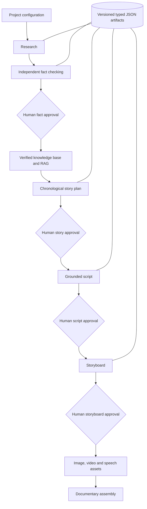

# Agentic History Studio

Agentic History Studio is an AI engineering project for producing source-grounded historical documentaries with explicit human review. The planned first demo is a five-minute Chinese documentary about Li Bai (李白).

**Under active development. Phase 1 implements deterministic infrastructure only and does not call AI models.** No API key or paid service is needed.

## Planned pipeline



The diagram describes the long-term system. Phase 1 supplies contracts, storage, workflow rules, and CLI inspection; generation and retrieval stages are not implemented.

## Architecture

- Python 3.13+, a src-layout package, Pydantic v2 contracts, and standard-library CLI and filesystem operations.
- Future agents exchange persisted typed artifacts instead of full conversation histories. Explicit orchestration will keep each stage understandable; no agent framework is installed.
- Human approvals are required for facts, story, script, and storyboard. Normal transitions cannot bypass gates. An external caller supplies an `ApprovalRecord` with a human identity, explicit `decision_source="human"`, project, stage, version, and timestamp. The state machine validates the latest artifact against its stage contract, persists the decision, and then changes its in-memory state. Human authentication belongs to the future application boundary; a Python literal alone cannot authenticate a person.
- Rejection or revision sends the workflow back to the corresponding generation/checking stage. Existing artifacts and approval records remain immutable. A new version must be saved for revised work; the same `(project_id, stage, artifact_version)` identity cannot receive a second decision. Facts artifacts may contain one `VerifiedFact` or a nonempty JSON list of them (serialized with Pydantic `RootModel`).
- `last_successful_state` tracks durable checkpoints: creation, research completion, persisted artifacts awaiting approval, approved stages, and completion. Entering a running stage does not advance it. `FAILED` preserves that checkpoint, records the interrupted stage separately in `failed_state`, and stores an error. `recover()` returns to `failed_state` for retry, clears failure metadata, and retains the checkpoint. For example, failure during `SCRIPT_GENERATING` retains `STORY_APPROVED`. Media generation and assembly retain `STORYBOARD_APPROVED` until `COMPLETE`, since there is no intermediate media-complete checkpoint in Phase 1. `COMPLETE` is terminal.
- `RuntimeState` is a validated immutable snapshot. The CLI initializes it under each project's ignored `.runtime/state.json`. Library callers persist later snapshots with `write_json(..., replace=True)`. Phase 1 is not a transactional workflow runner; callers must serialize workflow decisions and reconcile a persisted decision if interrupted before saving state.
- `ArtifactStore.save()` assigns `max(existing versions) + 1`. It serializes Pydantic JSON as UTF-8, flushes and fsyncs a temporary file, then publishes it with an exclusive hard link. Competing artifact writers retry with a new version. Existing versions cannot be overwritten through this API. Atomic replacement is reserved for runtime snapshots. This requires a local filesystem with hard-link support (such as NTFS); unsupported filesystems fail rather than fall back to unsafe writes. Process termination can leave an ignored-by-enumeration `.pending-*.tmp` file. Power-loss durability and hostile local filesystem modification are outside Phase 1's guarantees.
- Story beats and script scenes must have unique, increasing sequence numbers. Historical periods remain text; semantic chronological validation is deferred. Target duration and estimated duration are separate so callers can inspect differences. Shots use a global documentary timeline, forbid overlap, and permit gaps. Models do not query an external knowledge base.

## Repository structure

```text
.
├── .env.example
├── .gitignore
├── README.md
├── pyproject.toml
├── projects/
│   └── .gitkeep
├── src/history_studio/
│   ├── __init__.py
│   ├── __main__.py
│   ├── cli.py
│   ├── models/
│   │   ├── __init__.py
│   │   ├── base.py
│   │   ├── project.py
│   │   ├── sources.py
│   │   ├── research.py
│   │   ├── facts.py
│   │   ├── story.py
│   │   ├── script.py
│   │   └── storyboard.py
│   ├── workflow/
│   │   ├── __init__.py
│   │   ├── states.py
│   │   ├── state_machine.py
│   │   └── approvals.py
│   └── storage/
│       ├── __init__.py
│       └── artifact_store.py
└── tests/
    ├── test_models.py
    ├── test_state_machine.py
    ├── test_artifact_store.py
    └── test_cli.py
```

`projects/<id>/project.json` holds configuration. Artifacts live at `projects/<id>/<type>/<type>_vN.json`; approval records use the `approvals` type. Projects and public demo artifacts are deliberately not ignored: review them before committing. Runtime state, `.env`, `.runtime/`, `.logs/`, `.cost/`, and `.generated/` are ignored at any directory depth. Logs, cost tracking, and generated media directories are reserved only; no such services exist yet.

## Development setup

Install Python 3.13, then:

```bash
python -m venv .venv
# Linux/macOS:
source .venv/bin/activate
# Windows PowerShell instead:
# .venv\Scripts\Activate.ps1
python -m pip install -e ".[dev]"
```

Dependencies: **Pydantic** supplies domain validation and JSON serialization; **pytest** is the development-only test runner. **setuptools** is the build backend. There are no AI SDKs or orchestration frameworks.

## CLI

From the repository root with the environment activated:

```bash
python -m history_studio create --project-id li_bai --topic "李白" --language zh-CN --duration 5 --budget 20
python -m history_studio status li_bai
python -m history_studio review li_bai facts
python -m history_studio resume li_bai
```

Use `python -m history_studio --projects-dir /path/to/projects status li_bai` to select another root. Creation fails if the directory already exists; it never resets a project. Status reads and validates local state. Review points to an existing latest artifact and requests human review; it creates neither artifacts nor approvals. Resume only reports a recovery point and never runs future agents or changes state. Missing or malformed files produce a nonzero exit code. If creation is interrupted between configuration and runtime publication, inspect the project before manually restoring a validated runtime snapshot; rerunning create intentionally refuses to overwrite it.

## Tests

```bash
python -m pytest -q
```

Tests exercise validation, approval gates, failure recovery, immutable versioning, concurrent publication, interrupted writes, Chinese round trips, and the CLI subprocess entry point.

## Roadmap

- **Phase 1 (current):** typed contracts, explicit workflow, human approval records, local artifact versioning, runtime snapshots, CLI, and tests.
- **Phase 2:** research and independent fact checking, authenticated human review integration, persistent stage execution/recovery, verified knowledge base and controlled RAG context.
- **Later:** chronological story and script agents, storyboard creation, image/video/TTS providers, cost accounting, and video assembly with FFmpeg.

Cross-artifact referential validation, sophisticated historical dates, provider retries, and transactional multi-process workflow orchestration remain future work. No fake AI services are included.
